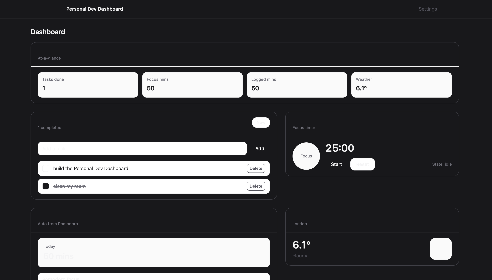
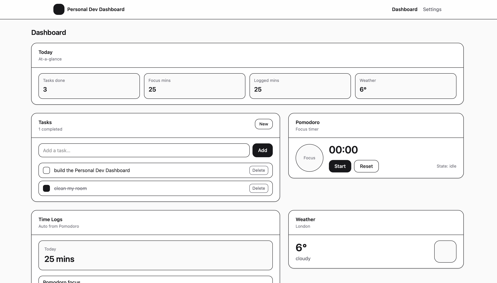
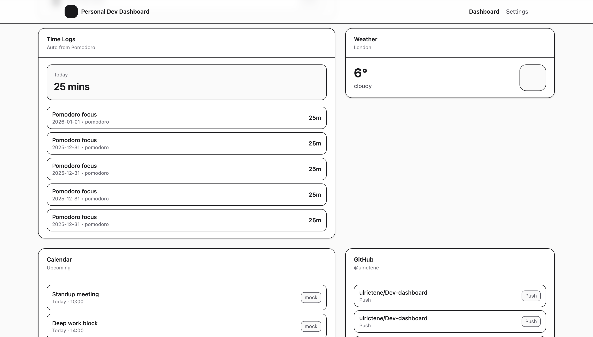
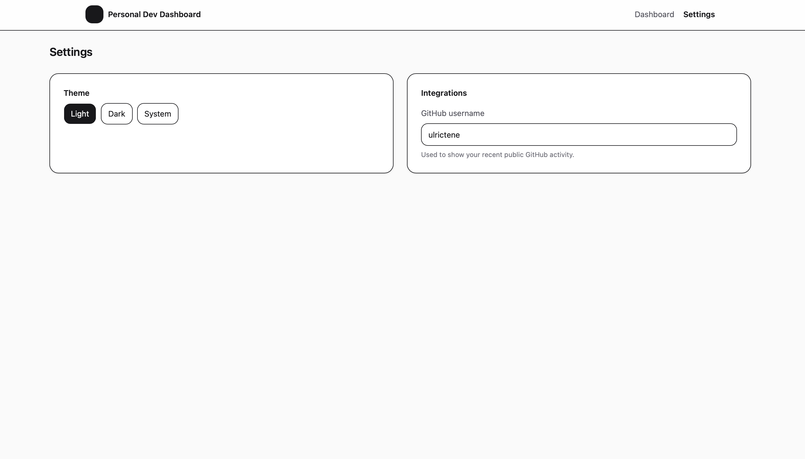

# Personal Dev Dashboard

A personal productivity dashboard built to explore **modern frontend architecture, state management, and API integration**.

The app combines task management, focus tracking, time logging, and live integrations into a clean, responsive interface.

---

## ✨ Features

- ✅ Task management (add, complete, delete)
- ⏱️ Pomodoro focus timer with accurate time tracking
- 📊 Automatic time logs from completed focus sessions
- 🌤️ Live weather data (Open-Meteo API)
- 🧠 GitHub activity widget (public events)
- 🗓️ Calendar widget (future-ready mock)
- 🌙 Light / Dark / System theme with persistence
- 💾 localStorage persistence for all user data

---

## 🛠️ Tech Stack

- **React + TypeScript**
- **Vite**
- **Tailwind CSS (v4, CSS-first)**
- **React Router**
- Public APIs (Open-Meteo, GitHub)

---

## 🧩 Architecture Highlights

- Feature-based folder structure
- Hooks for business logic (`useTasks`, `usePomodoro`, `useTimeLogs`)
- Clear separation of:
  - UI components
  - State logic
  - API services
- Defensive handling of time-based logic (Pomodoro accuracy)

---

## 📸 Screenshots





---

## 🚀 Running Locally

```bash
npm install
npm run dev

```
🔮 Future Improvements
Calendar API integration (Google / Outlook)
Manual time log editing
Weekly / monthly analytics
Account sync (Firebase / Supabase)
